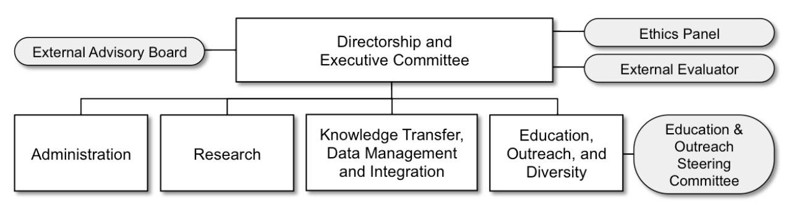

## Personnel

==Include graphic, and if so, update to include senior scientists and rotators, link boxes to sections, or do something more interactive with the page?==
<figure markdown="1"><caption>**Figure 1.** Our management plan facilitates the achievement of the principal scientific, education, and diversity goals of C-DEBI. We maintain a simple hierarchy in the management structure (rectangles) with several advisory groups (ovals) to encourage communication and collaboration, as well as provide transparency in decision-making.</caption></figure>

::: also
See the [C-DEBI Operations Manual](http://www.darkenergybiosphere.org/wp-content/uploads/docs/C-DEBIOperationsManual_2015.pdf) for details on the roles of each member of our leadership
:::

### Directorship, Executive Committee (ExCom) & Senior Scientists

Directorship leads Center scientific, education, diversity, outreach, and administrative activities with guidance from the Executive Committee. ExCom coordinates with the Senior Scientists on C-DEBI research directions.

<table class="list list-wide"><tbody><tr><td></td><td><a href="http://dornsife.usc.edu/cf/faculty-and-staff/faculty.cfm?pid=1038260">Jan Amend  </a>Professor of Microbial Geochemistry  University of Southern California</td><td>Director,  Principal Investigator, Executive Committee</td></tr><tr><td></td><td><a href="http://www.mbl.edu/jbpc/huber">Julie Huber</a>  Associate Scientist at Marine Biological Laboratory and Associate Professor of Marine Microbiology at Brown University</td><td>Associate Director,  Co-Investigator,  Executive Committee</td></tr><tr><td></td><td><a href="http://www.gso.uri.edu/profile/dhondt/">Steven D'Hondt</a>  Professor of Oceanography  University of Rhode Island</td><td>Co-Investigator,  Executive Committee  South Pacific Gyre Group Lead</td></tr><tr><td></td><td><a href="http://eps.ucsc.edu/faculty/Profiles/singleton.php?&amp;singleton=true&amp;cruz_id=afisher">Andrew Fisher</a>  Professor of Hydrogeology  University of California, Santa Cruz</td><td>Co-Investigator,  Executive Committee  Juan de Fuca Group Lead</td></tr><tr><td></td><td><a href="http://www.sfos.uaf.edu/directory/faculty/wheat/">C. Geoffrey Wheat</a>  Research Professor of Geological Oceanography  University of Alaska, Fairbanks</td><td>Co-Investigator,  Executive Committee  North Pond and Dorado Group Lead  Knowledge Transfer Director</td></tr><tr><td></td><td><a href="http://dornsife.usc.edu/cf/labs/jheidelberg/jheidelberg-faculty-display.cfm">John Heidelberg</a>  Associate Professor of Microbial Genomics  University of Southern California</td><td>Executive Committee  Data Management and Integration Director</td></tr><tr><td></td><td><a href="https://dornsife.usc.edu/cf/faculty-and-staff/staff.cfm?pid=1043669">Stephanie Schroeder</a>  Program Manager  University of Southern California</td><td>Executive Committee  Education Director</td></tr><tr><td></td><td><a href="https://dornsife.usc.edu/cf/faculty-and-staff/faculty.cfm?pid=1003247">Steven Finkel</a>  Professor of Bacterial Genetics and Molecular Biology  University of Southern California</td><td>Executive Committee (Rotator)  Senior Scientist</td></tr><tr><td></td><td><a href="https://www.gps.caltech.edu/content/victoria-j-orphan">Victoria Orphan</a>  Professor of Microbial Ecology and Geobiology  California Institute of Technology</td><td>Executive Committee (Rotator)  Senior Scientist</td></tr><tr><td></td><td><a href="https://www.bigelow.org/research/srs/beth-orcutt/">Beth Orcutt</a>  Senior Research Scientist  Bigelow Laboratory for Ocean Sciences</td><td>Senior Scientist</td></tr><tr><td></td><td><a href="https://profiles.stanford.edu/alfred-spormann">Alfred Spormann</a>  Professor of Microbial Physiology and Biochemistry  Stanford University</td><td>Senior Scientist</td></tr></tbody></table>

### Administration

==Could have more detail here==Manages the Center’s day-to-day activities.

<table class="list"><tbody><tr><td></td><td><a href="http://dornsife.usc.edu/cf/faculty-and-staff/staff.cfm?pid=1027240">Rosalynn Sylvan</a>  University of Southern California</td><td>Managing Director</td></tr><tr><td></td><td><a href="https://my.usc.edu/wp/faculty/ViewDetail.do?uscpvid=scqf3qv9">Nerissa Rivera</a>  University of Southern California</td><td>Administrative Assistant</td></tr></tbody></table>

### Knowledge Transfer (KT) &amp; Data Management and Integration (DMI)

==Not clear what "Knowledge Transfer" means here.==Knowledge Transfer is central to all of C-DEBI’s research, education, and outreach programs, and hence, it is the responsibility of all our senior personnel as well as the KT Director.

The Data Management and Integration team has the primary objective ==Definitely a key *responsibility*, as mentioned later in the paragraph, but isn't the *objective* to enable cross-disciplinary data synthesis?==++to make C-DEBI data and products accessible to the world via a data portal++. The DMI Director also ensures that C-DEBI participants have access to the Center’s computational resources and/or bioinformatics expertise, as well as making certain C-DEBI generated data are properly deposited in public archives and databases.

<table class="list"><tbody><tr><td></td><td><a href="http://www.sfos.uaf.edu/directory/faculty/wheat/">C. Geoffrey Wheat</a>  University of Alaska, Fairbanks</td><td>Knowledge Transfer Director</td></tr><tr><td></td><td><a href="http://dornsife.usc.edu/cf/labs/jheidelberg/jheidelberg-faculty-display.cfm">John Heidelberg</a>  University of Southern California</td><td>Data Management Director</td></tr><tr><td></td><td><a href="https://my.usc.edu/wp/faculty/ViewDetail.do?uscpvid=scdm5jv2">Matthew Janicak</a>  University of Southern California</td><td>Data Manager</td></tr><tr><td></td><td><a href="http://web.uri.edu/coastalinstitute/meet/robert-pockalny/">Robert Pockalny</a>  University of Rhode Island</td><td>Data Portal Lead</td></tr><tr><td></td><td><a href="mailto:tully.bj@gmail.com">Benjamin Tully</a>  University of Southern California</td><td>Bioinformatics Specialist</td></tr></tbody></table>

### Education, Outreach, and Diversity (EOD)

==Could have more detail here==The EOD team develops, implements, and coordinates programs and activities integrating C-DEBI research at all levels.

<table class="list"><tbody><tr><td></td><td><a href="http://dornsife.usc.edu/cf/faculty-and-staff/staff.cfm?pid=1043669">Stephanie Schroeder</a>  University of Southern California</td><td>Education Director</td></tr><tr><td></td><td><a href="https://my.usc.edu/wp/faculty/ViewDetail.do?uscpvid=scrb7xs5">Leticia Sanchez</a>  University of Southern California</td><td>Diversity Director</td></tr><tr><td></td><td><a href="http://dornsife.usc.edu/cf/faculty-and-staff/faculty.cfm?pid=1012506&amp;CFID=5588909&amp;CFTOKEN=53163797">John Heidelberg</a>  University of Southern California</td><td>GEM Course Instructor</td></tr><tr><td></td><td><a href="http://dornsife.usc.edu/cf/faculty-and-staff/faculty.cfm?pid=1012510">Eric Webb</a>  University of Southern California</td><td>GEM Course Instructor</td></tr><tr><td></td><td><a href="https://sites.google.com/site/paigeconnellusc/">Paige Connell</a>  University of Southern California</td><td>GEM Course TA</td></tr></tbody></table>

### External Advisory Board

Provides annual assessments of the science, education, mentoring, management, and ~~functioning of C-DEBI as a whole~~ ++cohesion (or performance) of the Center++ to the Directorship.

<table class="list"><tbody><tr><td></td><td><a href="https://www.whoi.edu/profile/shumphris/">Susan Humphris</a>  Woods Hole Oceanographic Institution</td><td>External Advisory Board Chair</td></tr><tr><td></td><td><a href="http://scrippsscholars.ucsd.edu/dbartlett">Doug Bartlett  </a> Scripps Institution of Oceanography</td><td>External Advisory Board</td></tr><tr><td></td><td><a href="https://www.moore.org/people-detail?personUrl=jonk">Jon Kaye</a>  Gordon and Betty Moore Foundation</td><td>External Advisory Board</td></tr><tr><td></td><td><a href="http://www.arc.losrios.edu/">Rina Roy</a>  American River College</td><td>External Advisory Board</td></tr><tr><td></td><td><a href="http://biochem.missouri.edu/faculty/faculty-members/wallj/index.php">Judy Wall</a>  University of Missouri</td><td>External Advisory Board</td></tr></tbody></table>

### Ethics Panel

Advises ExCom on any issue pertaining to ethics, including concerns regarding administration, funding, and scientific conduct.  This Panel handles all C-DEBI ethics complaints==Since ethics reporting can be anonymous, should we be listing any reporting stats, even if zero, as this could be taken as pressure to not "break the record"?==++(none to date)++.

<table class="list"><tbody><tr><td></td><td><a href="http://micro.utk.edu/faculty/lloyd.php">Karen Lloyd</a>  University of Tennessee, Knoxville</td><td>Ethics Panel Chair, Faculty Representative</td></tr><tr><td></td><td><a href="http://ceoas.oregonstate.edu/profile/colwell/">Rick Colwell</a>  Oregon State University</td><td>Faculty Representative</td></tr><tr><td></td><td><a href="http://www.ldeo.columbia.edu/user/scooper">Sharon Cooper</a>  Lamont-Doherty Earth Observatory</td><td>Education Representative</td></tr><tr><td></td><td><a href="http://eps.ucsc.edu/faculty/Profiles/singleton.php?&amp;singleton=true&amp;cruz_id=afisher">Andy Fisher</a>  University of California, Santa Cruz</td><td>ExCom Representative</td></tr><tr><td></td><td><a href="http://www.en.palaeontologie.geowissenschaften.uni-muenchen.de/personen/professuren/altenbach1/index.html">Bill Orsi</a>  Ludwig Maximilian University of Munich</td><td>Early Faculty Representative</td></tr></tbody></table>

### External Evaluator

Assesses and evaluates the effectiveness of C-DEBI management, research (specifically expeditions), and EOD programs and provides thorough, ~~rigorous,~~ independent, and ~~results~~++data++-based assessments.

<table class="list"><tbody><tr><td></td><td><a href="http://www.linkedin.com/pub/beth-rabin/9/755/172">Beth Rabin</a></td><td>External Evaluator</td></tr></tbody></table>

### Education and Outreach Steering Committee

Advises the EOD Administration and helps to review ~~the small~~ education and outreach grant proposals.

<table class="list"><tbody><tr><td></td><td><a href="http://www.e3s-center.org/people/directory/sartis">Sharnnia Artis</a>  University of California Berkeley</td><td>Education and Outreach Steering Committee</td></tr><tr><td></td><td><a href="https://reuslawr.wordpress.com/author/geoalliance/">Diana Dalbotten</a>  University of Minnesota</td><td>Education and Outreach Steering Committee</td></tr><tr><td></td><td><a href="http://www.stccmop.org/user/greenv">Vanessa Green</a>  Oregon Health &amp; Science University</td><td>Education and Outreach Steering Committee</td></tr><tr><td></td><td><a href="http://www.nobcche.gtorg.gatech.edu/advisors">Keith Oden</a>  Georgia Institute of Technology</td><td>Education and Outreach Steering Committee</td></tr></tbody></table>

::: also
See the [C-DEBI Operations Manual](http://www.darkenergybiosphere.org/wp-content/uploads/docs/C-DEBIOperationsManual_2015.pdf) for details on the roles of each member of our leadership
:::

## Other Participants

==Pre-emptively re-named section to "Other Participants," since using "Community" as section header==

In addition to the lead investigators at the primary institutions, C-DEBI supports deep biosphere community research at over 40 institutions in nearly 90 projects including about 40 graduate student and postdoctoral research fellowships, as well as E&O grants and travel exchanges.

::: also
See [Funded Projects](../research/funded-projects.md)
:::

The C-DEBI community also includes over 900 members from 28 countries that stay informed of C-DEBI activities and opportunities via our mailing list.

::: also
See [Mailing List](mailing.md)
:::
